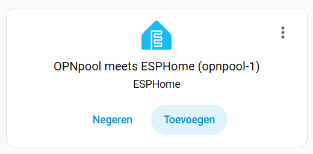

# OPNpool meets ESPHome

[](https://github.com/cvonk/OPNpool_meets_ESPHome/discussions)


This is a port of my [original OPNpool](https://github.com/cvonk/OPNpool) to the ESPHome platform.

The OPNpool integrates the functionality of a traditional Pool Controller into the modern smart home. It keeps tabs on the status of the connected controller, pool pump and chlorinator. This provides not only a more convenient solution than physically interacting with the pool equipment, but the ability to create automations that runs the pump for a duration depending on the temperature.

Features:

  - [x] Visualizes the status of the thermostats, pump, chlorinator, circuits, and schedules.
  - [x] Allows you adjust the thermostats and toggle circuits remotely
  - [x] No physical connection to your LAN
  - [x] Supports over-the-air updates [^1]
  - [x] Integrates seamlessly with Home Assistant
  - [x] Accessible as a webapp
  - [x] Protected with IP68 waterproof case and connectors [^1]
  - [x] Open source!

This device was tested with the Pentair SunTouch controller with firmware **2.080**, connected to an IntelliFlo pump and IntelliChlor salt water chlorinator.

> This open source and hardware project is intended to comply with the October 2016 exemption to the Digital Millennium Copyright Act allowing "good-faith" testing," in a controlled environment designed to avoid any harm to individuals or to the public.

## Parts

At the core this project is an ESP32 module and a 3.3 Volt RS-485 adapter. You can breadboard this using:

* Any ESP32 module that has an USB connector and `GPIO#25` to `GPIO#27` available (such as the Wemos LOLIN D32).
* Any "Max485 Module TTL". To make it 3.3 Volt compliant, change the chip to a MAX3485CSA+. While you're at it, you may as well remove the 10 kΩ pullup resistors (often labeled `R1` to `R4`).
* A piece of Cat5 ethernet cable to connect to the pool controller.

If you want to make this a more permanent solution, I suggest rolling a printed circuit board and housing it in a IP68 waterproof case with IP68 connectors.  More about this later.

## Acknowledgements

> We proudly acknowledge the work of reverse engineering pioneers [Joshua Bloch](https://docs.google.com/document/d/1M0KMfXfvbszKeqzu6MUF_7yM6KDHk8cZ5nrH1_OUcAc/edit), [Michael Russe](http://cocoontech.com/forums/files/file/173-pab014sharezip/), and [George Saw](http://cocoontech.com/forums/topic/27864-download-pitzip/). (Drop me a line if if I forgot you.)

## Usage

Start with [installing the ESPHome environment](https://esphome.io/guides/installing_esphome/) on a biefy computer. In my case, this cut the compilation time to a minute, compared to half an hour when running it as an addon to Home Assistant.

Create a `opnpool-1.yaml` configuration file, that contains the `external_components`,
`logger` and `opnpool` keys.

```yaml
substitutions:
  device_name: opnpool-1
  friendly_name: "OPNpool meets ESPHome"
  description: "External component, see https://github.com/cvonk/OPNpool_meets_ESPHome"

esphome:
  name: ${device_name}
  comment: ${description}
  friendly_name: ${friendly_name}

esp32:
  variant: ESP32
  board: esp32dev
  framework:
    type: esp-idf

wifi:
  domain: !secret domain_name # only needed if not on the same subnet
  min_auth_mode: WPA2
  reboot_timeout: 0s
  networks:
  - ssid: !secret wifi_ssid
    password: !secret wifi_password

api:

ota:
  - platform: esphome
    password: !secret ota_password

external_components:
  - source: github://cvonk/OPNpool_meets_ESPHome
    components: [ opnpool ]

logger:
  level: VERBOSE       # build includes ESP_LOGx up to VERBOSE
  initial_level: WARN  # only show up to WARN globally
  logs:
    pool_state_rx: VERBOSE

opnpool:
  id: opnpool_1
  rs485:
    rx_pin: 25            # GPIO25
    tx_pin: 26            # GPIO26
    flow_control_pin: 27  # GPIO27
```

Specify your secrets in `secrets.yaml`

```yaml
wifi_ssid: "REDACTED"
wifi_password: "REDACTED"
domain_name: ".iot.example.com" # appended to base fname to create FQDN for OTA updates
ota_password: "REDACTED"
api_encryption_key: "REDACTED"
```

On the serial output, you should see something like

```text
[16:26:54.983]I (423) boot: Loaded app from partition at offset 0x10000
[16:26:55.024]I (465) boot: Set actual ota_seq=1 in otadata[0]
[16:26:55.029]I (465) boot: Disabling RNG early entropy source...
[16:26:55.268][W][component:333]: api set Warning flag: unspecified
[16:26:55.273][W][component:342]: wifi set Warning flag: scanning for networks
[16:27:01.293][W][component:373]: wifi cleared Warning flag
[16:27:25.143][E][rs485:108][pool_req_task]: tx_q full
[16:27:55.144][E][rs485:108][pool_req_task]: tx_q full
```

The `tx_q full` indicates that it can't transmit to the pool controller.

On your Home Assistant UI, under Settings > Integrations, you should find that it
auto discovered the device.



Add it, and specify your API key.  Name the device and assign it an area. You should
then see the enities although their values are `unknown`.  Time to populate those
entities by connecting it to the pool controller ;-)


### Connect

> :warning: **THIS PROJECT IS OFFERED AS IS. IF YOU USE IT YOU ASSUME ALL RISKS. NO WARRENTIES. At the very least, turn off the power while you work on your pool equipment. Be careful, THERE IS ALWAYS A RISK OF BREAKING YOUR POOL EQUIPMENT.**

Understanding the above warning .. the RS-485 header can be found on the back of the control board. There are probably already wires connected that go to the devices such as pump and chlorinator.


To minimize electromagnetic interference, use a twisted pairs from e.g. CAT-5 cable to connect the `A`/`B` pair to the RS-485 adapter as shown in the table below.

| Controller       | RS-485 adapter | idle state |         
|:-----------------|:--------------:|:-----------|
| `-DATA` (green)  |  `A`           | negative   |
| `+DATA` (yellow) |  `B`           | positive   |

Connect the RS-485 adapter to the ESP32 module.  I also pulled `GPIO#27` down with a 10 k&ohm; resistor, to keep it from transmiting while the ESP32 is booting.

| RS-485 adapter | ESP32 module |
|:---------------|:-------------|
| RO             | `GPIO#25`    |
| DI             | `GPIO#26`    |
| DE and RE      | `GPIO#27`    |
| GND            | `GND`        |

The serial monitor will show decoded messages such as:

```json
{
{CTRL_VERSION_REQ: {}}
{CTRL_VERSION_RESP: {"firmware":"2.80"}}
{CTRL_TIME_REQ: {}}
{CTRL_TIME_RESP: {"tod":{"time":"18:51","date":"2026-01-18"}}}
{CTRL_HEAT_REQ: {}}
{CTRL_HEAT_RESP: {"thermos":{"POOL":{"temp":54,"sp":63,"src":"NONE"},"SPA":{"temp":54,"sp"}
```

In Home Assistant the entities should populate:


FYI, the [`hass-config` project](https://github.com/cvonk/hass-config) has my Lovelace dashboard configuration.

## PCB

We will build a printed circuit board (PCB) with an ESP32 module, RS-485 adapter and DC/DC converter.

If you're in Silicon Valley, give me a ping to avoid long lead times. I have extra (partly) assenmbled units and will provide them at cost.
If there is enough interest, I can start a project on Tindie or Crowd Supply to get some volume pricing.

### Schematic

A buck converter provides 5 Volts to the battery connector on the LOLIN D32 daughterboard. Using the battery input, helps prevent problems when it is also powered through the USB connector.


The data path is between the RS-485 connector and the ESP32 on the LOLIN D32 daughterboard.  There is an optional terminator resistor to prevent reflections on the bus. The JTAG header is for debugging as detailed in the Debugging chapter of the design document.


### Board layout

The schematic fits easily on a two layer PCB. Note the cut out for the RF antenna.


### Bill of materials

| Name        | Description                                             | Sugggested mfr/part#       |
|-------------|---------------------------------------------------------|----------------------------|
| PBC r2      | Printed circuit board                                   | OSHPark                    |
| Enclosure   | 158x90x60mm clear plastic project enclosure, IP65       | *white label*              |
| LOLIN D32   | Wemos LOLIN D32, based on ESP-WROOM-32 4MB              | Wemos LOLIN-D32            |
| RS485_CONN  | Plug+socket, male+female, 5-pin, 16mm aviation, IP68    | SD 16                      | 
| MAX3485     | Maxim MAX3485CSA, RS-485/UART interface IC 3.3V, 8-SOIC | Analog-Devices MAX3490ECSA |
| DC1         | DC/DC Converter R-78E5.0-0.5, 7-28V to 5V, 0.5A, 3-SIP  | RECOM-Power R-78E5.0-0.5   |
| D1          | Schottky Diode, 1N5818, DO-41                           | ON-Semiconductor 1N5818RLG |
| LED1        | LED, Green Clear 571nm, 1206                            | Lite-On LTST-C150KGKT      |
| LED2        | LED, Amber Clear 602nm, 1206                            | Lite-On LTST-C150AKT       |
| C1, C2      | Capacitor, 10 µF, 25 V, multi-layer ceramic, 0805       | KEMET C0805C106K3PACTU     |
| C3          | Capacitor, 0.1 µF, 6.3 V, multi-layer ceramic, 0805     | KEMET C0805C104M3RACTU     |
| R1, R2      | Resistor, 68 Ω, 1/8 W, 0805                             | YAGEO RC0805FR-0768RL      |
| R3          | Not stuffed, resistor, 120 Ω, 1/4 W, 0805               | KAO SG73S2ATTD121J         |
| RS485-TERM  | Fixed terminal block, 4-pin, screwless, 5 mm pitch      | Phoenix-Contact 1862291    |
| SW1         | Tactile Switch, 6x6mm, through hole                     | TE-Connectivity 1825910-4  |
| PCB Screws  | Machine screw, #6-32 x x 3/16", panhead                 | Keystone-Electronics 9306  |
| CONN Screws | Machine screw, M2-0.4 x 16 mm, cheese head              | Essentra 50M020040D016     |
| CONN Nuts   | Hex nut, M2-0.4, nylon                                  | Essentra 04M020040HN       |

[^1]: We shared our [PCB order](https://oshpark.com/shared_projects/nS1z3Duu) for your convienence.

At the core this project is an ESP32 module and a 3.3 Volt RS-485 adapter. You can breadboard this using:

* Any ESP32 module that has an USB connector and `GPIO#25` to `GPIO#27` available (such as the Wemos LOLIN D32).
* Any "Max485 Module TTL". To make it 3.3 Volt compliant, change the chip to a MAX3485CSA+. While you're at it, you may as well remove the 10 kΩ pullup resistors (`R1` to `R4`).
* A piece of Cat5 ethernet cable to connect to the pool controller.

### Debugging

Not all controller firmware is created equally.  If you are not using the same firmware version, you will need to adjust the code.

To show more (or less) debug information, specify the levels in `opnpoool-1.yaml`

```yaml
logger:
  level: VERBOSE       # build includes ESP_LOGx up to VERBOSE
  initial_level: WARN  # only show up to WARN globally
  logs:
    rs485: WARN
    datalink_rx: WARN
    datalink_tx: WARN
    network_rx: WARN
    network_create: WARN
    pool_task: VERBOSE
    pool_state: WARN
    pool_state_rx: VERBOSE
    opnpool: VERBOSE
    opnpool_climate: VERBOSE
    opnpool_switch: VERBOSE
    opnpool_binary_sensor: VERBOSE
    opnpool_text_sensor: WARN
    enum_helpers: VERBOSE
```

If you get stack traces, I suggest enabling the stack trace decoder

```yaml
debug:
  update_interval: 5s  # for exception decoding in logs
```

### Development

For better development experience: in VS Code, install the ESPHome extension.

Clone the repository and its submodules to a local directory. The `--recursive` flag automatically initializes and updates the submodules in the repository.

```bash
git clone --recursive https://github.com/cvonk/OPNpool_meets_ESPHome.git
```

or using `ssh`
```bash
git clone --recursive git@github.com:cvonk/OPNpool_meets_ESPHome.git
```

The `tasks.json` file defines the build tasks. It will map the compile pathnames back from the build directory to the project directory.  You can then inspect the build output in the PROBLEMS tab in VS Code.

Short cuts:

  * Build with ctrl-shift-b, or on mac use cmd-shift-b.  
  * Compile & upload with ctrl-shift-p → "Run Task" → "ESPHome Upload"
  * View logs with ctrl-shift-p → "Run Task" → "ESPHome Monitor"

Remember: if the ESP32 crashes, you will only see that on the serial console.

## Design documentation

The design documentation for the (original OPNpool project)[https://github.com/cvonk/OPNpool] is still available at
[https://coertvonk.com/category/sw/embedded/opnpool-design](https://coertvonk.com/category/sw/embedded/opnpool-design). The following chapters are relevant here:

- [RS-485 bus](https://coertvonk.com/sw/embedded/opnpool-design/bus-access-31957)
- [Hardware](https://coertvonk.com/sw/embedded/opnpool-design/hardware-3-31959)
- [Protocol](https://coertvonk.com/sw/embedded/opnpool-design/protocol-31965)
